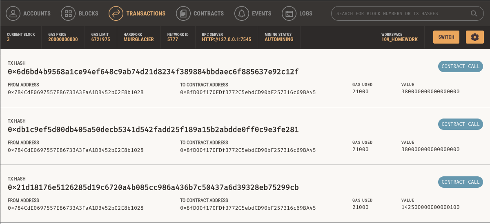

# FinTech_Unit-19_Cryptocurrency-Wallet
Homework for Unit 19, Blockchain.

## Unit 19 Homework: Cryptocurrency Wallet

# Technology Used:
## python, VS Code, Streamlit (streamlit.io), and Ganache (Trufflesuite.com).
### python script is run from terminal using: streamlit run fintech_finder.py
### User must supply .env file that contains a 12-word mnemonic for their personal Etherium account from Ganache. The .env file contains: MNEMONIC = '12-word mnemonic'

### Background

You work at a startup that is building a new and disruptive platform called Fintech Finder. Fintech Finder is an application that its customers can use to find fintech professionals from among a list of candidates, hire them, and pay them. As Fintech Finder’s lead developer, you have been tasked with integrating the Ethereum blockchain network into the application in order to enable your customers to instantly pay the fintech professionals whom they hire with cryptocurrency.

In this Challenge, you will complete the code that enables your customers to send cryptocurrency payments to fintech professionals. To develop the code and test it out, you will assume the perspective of a Fintech Finder customer who is using the application to find a fintech professional and pay them for their work.

---

## Submission

* Upload the files for this assignment to your GitHub repository.

* Submit the link to your GitHub repo on Bootcamp Spot.

---

© 2021 Trilogy Education Services, a 2U, Inc. brand. All Rights Reserved.
